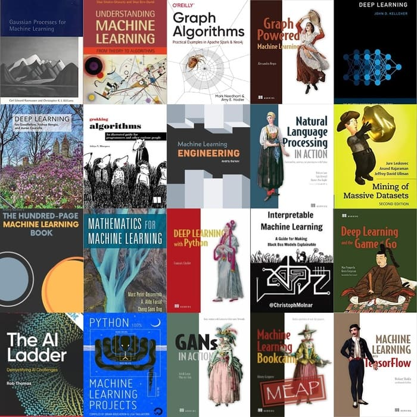

--------------------------------------------------------------------------------

# Useful ML/DL open-course resources

**My personal path** to learn Deep Learning. 


## Table of Contents
<ul>
<li><a href="#Open-course">Open course</a></li>
<li><a href="#GitHub-tutorial-projects">GitHub tutorial projects</a></li>
<li><a href="#Blogs-and-manuals">Blogs and manuals</a></li>
<li><a href="#Books">Books</a></li>
<li><a href="#Get-started-a-dev-environment">Get started a dev environment</a></li>
</ul>

## Open course
**ranking by popularity**

| No.   | Open course                                            |Tool       | Links           |
| :----:| :----:                                              | :----:   | :----:          |
| 1     | Machine Learning by Andrew Ng  | -  | [coursera](https://www.coursera.org/learn/machine-learning)|
| 2     | Introduction to Deep Learning by MIT  |  tf2.x, Colab | [website](http://introtodeeplearning.com/), [YouTube](https://www.youtube.com/playlist?list=PLtBw6njQRU-rwp5__7C0oIVt26ZgjG9NI)|
| 3     | Deep Learning Specialization by Andrew Ng  | tf1.x, tf2.x |  [coursera](https://www.coursera.org/specializations/deep-learning), [网易](https://mooc.study.163.com/smartSpec/detail/1001319001.htm/)|
| 4     | Convolutional Neural Networks for Visual Recognition by F. Li (Stanford)  | PyTorch, tf2.x | [website](http://cs231n.stanford.edu/)|
| 5     | Natural Language Processing with Deep Learning by C. Manning (Stanford)  |  PyTorch  | [website](http://web.stanford.edu/class/cs224n/), [YouTube](https://www.youtube.com/playlist?list=PLoROMvodv4rOhcuXMZkNm7j3fVwBBY42z)|
| 6     | Deep Learning by Yann LeCun (NYU)  | PyTorch  | [website](https://atcold.github.io/pytorch-Deep-Learning/), [YouTube](https://www.youtube.com/playlist?list=PLLHTzKZzVU9eaEyErdV26ikyolxOsz6mq)|
| 7     | Practical Deep Learning for Coders by Jeremy Howard  | PyTorch, fastai  | [website](https://course.fast.ai/)|
| 8     | 3bule1brown | - |[YouTube](https://www.youtube.com/watch?list=PLZHQObOWTQDNU6R1_67000Dx_ZCJB-3pi&v=aircAruvnKk&feature=youtu.be), [B站](https://space.bilibili.com/88461692/#/) |


## GitHub tutorial projects

| No.   | Project                                  | Remark           |
| :----:| :----:                                   | :----:          |
| 1   | [A Whirlwind Tour of Python](https://github.com/jakevdp/WhirlwindTourOfPython)    | python beginner |
| 2   | [Machine Learning with TensorFlow](https://github.com/BinRoot/TensorFlow-Book)    | good |
| 3   | [30天吃掉那只TensorFlow2](https://github.com/lyhue1991/eat_tensorflow2_in_30_days)   | great|
| 4   | [20天吃掉那只Pytorch](https://github.com/lyhue1991/eat_pytorch_in_20_days)    | great|
| 5   | [Probabilistic Programming and Bayesian Methods for Hackers](https://github.com/CamDavidsonPilon/Probabilistic-Programming-and-Bayesian-Methods-for-Hackers)    | Probabilistic programming, pyMC3|

## Blogs and manuals
| No.   | books and blogs                          | Remark           |
| :----:| :----:                                   | :----:          |
| 1   | [NumPy for MATLAB users](https://numpy.org/doc/stable/user/numpy-for-matlab-users.html)   | 10 mins |
| 2   | [Python Numpy Tutorial](https://cs231n.github.io/python-numpy-tutorial/#arrays)    | 10 mins|
| 3   | [刘江的python blog](https://www.liujiangblog.com/course/python/3) | 简洁中文指南|
| 4   | [Chriss Olah’s blogs](http://colah.github.io/)   | nice tutorials for AI|
| 5   | [Jupyter Notebook Keyboard Shortcuts](https://cheatography.com/weidadeyue/cheat-sheets/jupyter-notebook/)   |cheet sheet|
| 6   | [Using git](https://training.github.com/downloads/zh_CN/github-git-cheat-sheet/)，[Resources to learn Git](https://try.github.io/)  |cheet sheet|
| 7   | [Using conda](https://kapeli.com/cheat_sheets/Conda.docset/Contents/Resources/Documents/index)，[official guide](https://docs.conda.io/projects/conda/en/latest/user-guide/getting-started.html)  |cheet sheet|


## Books
The online **books and blogs**:

| No.   | books and blogs                                  | Links           |
| :----:| :----:                                                  | :----:          |
| 1     | Neural Networks and Deep Learning by M. Nielsen   | [online](http://neuralnetworksanddeeplearning.com/)|
|2    |  Deep Learning by Ian Goodfellow    | [online](https://github.com/janishar/mit-deep-learning-book-pdf/blob/master/complete-book-bookmarked-pdf/deeplearningbook.pdf/), [中文](https://github.com/exacity/deeplearningbook-chinese)|
| 3   | Deep Learning with PyTorch (official guide book)  | [PDF](https://pytorch.org/assets/deep-learning/Deep-Learning-with-PyTorch.pdf)|


More (100+) free **AI books** [online](https://www.theinsaneapp.com/2020/12/download-free-machine-learning-books.html):
<div>
    <div style="text-align:center">
    
</div>


## Get started a dev environment

**1. Create a new dev env (win10+anaconda+VS code)**  
by following commands in 'anaconda prompt' or 'cmd' or 'VS code terminal (bash)':
```
conda info -e # check current env
conda create --name my_env # an empty env named my_env 
conda activate my_env # if fail in VS code terminal (bash), see issue below 
conda install package_name
conda install pip # Must do this before using pip! see reason below！
pip install package_name # pip may support more packages than conda
``` 
安装特定版本的包　conda用“=”，pip用“==”:
```
conda install numpy=1.93
pip install numpy==1.93
```

**Note: pip不一定作用在当前环境!** 

首先check用的是本环境的pip，这样pip install的包会安装到到当前环境中（base环境otherwise).
在当前环境下，用下面bash命令check要用的pip 属于哪个环境：
```
which -a pip 
```
做一个小实验验证pip install可能产生的问题: 在当前env下，pip install (不太常用的包）'folium'在本env中（而不是base环境中）.  'conda list' (1st below) 中，可以看到'folium' (pip安装的包后面有标注pypi)。回到base环境， Again, 'conda list' (2nd below) 不会出现folium. 否则，是误用了base环境下的pip，所以包被安装到base环境中(污染base环境).
```
conda create --name my_env python=3.7
pip install folium # package visualizing geospatial data
conda list
conda deactivate
conda info -e 
conda list
conda remove -n my_env --all # Delete an environment
```


**2. Can't execute 'conda activate' in bash terminal of VS code (win10)**
```
eval "$(conda shell.bash hook)"
conda activate my_env
``` 

**3. Create an env for tf2.2-GPU (win10)**  
tf 2.2 requres python 3.5-3.8, CUDA 10.1, cuDNN 7.6. More [CUDA version infor](https://www.tensorflow.org/install/source#tested_build_configurations).  tf2.3 and higher do not work with my CUDA. Somehow only py3.7 (not higher) works well with tf2.2-GPU. 
```
conda create -n py37_tf2.2 python=3.7 anaconda # 'anaconda' enables a full copy from the base env
conda activate py37_tf2.2
pip install tensorflow-gpu==2.2
python
import tensorflow as tf
print("Num GPUs Available:",len(tf.config.experimental.list_physical_devices('GPU')))
```

以下命令区别是：
(1)建立一个完全空的环境（注意：no built-in pip here，使用'pip install'会安装到base环境！）; 
(2)把base环境完整复制过来，包含了常用的包如pip，numpy和已经在anaconda启动页安装的Jupyter notebook等; 
(3) 建立一个非空环境，包含了对应的python版本和pip; 
(4) make an exact copy of an environment by creating a clone of it.

建议使用(2,3 or 4）！
```
conda create --name my_env
conda create --name my_env anaconda
conda create --name my_env python=3.7
conda create --name new_env --clone exist_env
```

**4. Create an env for PyTorch-GPU (win10)**  
安装GPU版本，对应CUDA 10.1. The 2nd command is generated from [PyTorch page](https://pytorch.org/get-started/locally/)  
```
conda create --name py38_torch python=3.8 anaconda
conda install pytorch torchvision torchaudio cudatoolkit=10.1 -c pytorch
python
import torch
torch.cuda.is_available()
```

**5. Check GPU (NVIDIA) status (win10)**   
for windows, 为了方便使用nvidia-smi.exe, 打开环境变量，在path（top panel – user variables）里添加：C:\Program Files\NVIDIA Corporation\NVSMI
```
nvidia-smi
```
Check your [NVIDIA GPU Compute Capability](https://developer.nvidia.com/cuda-gpus).
